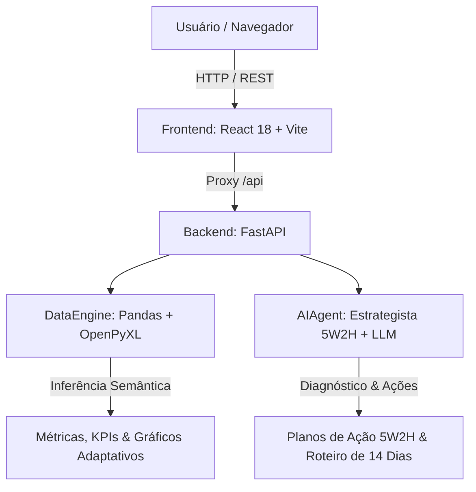

# 📊 Decisões Inteligentes — Inteligência de Negócios & BI Estratégico

> Plataforma full-stack de Business Intelligence (BI) e Inteligência Artificial analítico-estratégica capaz de interpretar **qualquer planilha de dados brutos** (`.xlsx` e `.csv`), gerar painéis executivos interativos em tempo real e atuar como um verdadeiro **Chief Strategy Officer (CSO)** com planos de ação corretivos (framework 5W2H).

---

## 🌟 Destaques da Plataforma

- **🔍 Motor 100% Agnóstico a Schemas**: Ingestão universal de qualquer planilha (Vendas, RH, Finanças, Imóveis, Logística, Marketing). Identifica automaticamente métricas primárias, dimensões categóricas e séries temporais.
- **🎯 Modo Estrategista Executivo (Chief Strategy Officer)**: Diagnóstico automatizado de gargalos (desvios de rentabilidade, assimetrias regionais, quedas periódicas) acompanhado de **Planos de Ação Táticos (5W2H)** com prazos (SLA) e metas numéricas de recuperação.
- **📊 Suporte a 4 Tipos de Gráficos Interativos**:
  - 📊 **Colunas Verticais**: Comparativo direto de grandezas entre categorias.
  - 📈 **Linha / Área de Tendência**: Curvas suaves (spline Bézier) com gradiente para evolução temporal.
  - 🍩 **Rosca / Composição (Donut)**: Distribuição percentual e participação de mercado com cálculo dinâmico.
  - 📑 **Ranking de Barras Horizontais**: Destaque para os maiores valores (*Top N*).
  - 🔀 **Alternância Instantânea**: Seletor no cabeçalho de cada cartão gráfico.
- **🧹 Arquitetura Clean-Slate (Dashboard Limpo)**: O painel inicia em estado de prontidão e oferece o botão **"Limpar Tela"**, permitindo reiniciar o ciclo analítico para novas planilhas a qualquer momento.
- **💬 BI Conversacional com Gráficos Embutidos**: Chat assistivo que responde perguntas em linguagem natural e projeta tabelas e gráficos interativos diretamente dentro dos balões de resposta.
- **🌐 Suporte a Provedores de IA**: Motor analítico estratégico nativo (offline) com suporte opcional e configurável a Google Gemini, Groq (Llama 3.3 70B), OpenAI e OpenRouter.

---

## 🏗️ Arquitetura do Sistema



### Tecnologias Utilizadas:
- **Frontend**: React 18, Vite, Lucide React, Design System CSS Puro (Dark Mode, Glassmorphism, Paleta HSL, Tipografia Outfit & Plus Jakarta Sans).
- **Backend**: FastAPI, Uvicorn, Pandas, OpenPyXL, NumPy, HTTPX.
- **Arquitetura de Dados**: Tratamento resiliente de números formatados (R$, vírgula/ponto decimal, datas variadas, delimitadores `,` e `;`).

---

## 📁 Estrutura do Repositório

```text
workspace_eficiente/
│
├── README.md                      # Documentação técnica completa
│
├── backend/                       # Servidor API FastAPI
│   ├── main.py                    # Endpoints REST (upload, summary, chat, clear, preview)
│   ├── data_engine.py             # Motor agnóstico de análise e inferência de dados
│   ├── ai_agent.py                # Agente Estrategista Sênior (CSO) e integração com LLMs
│   └── requirements.txt           # Dependências Python
│
├── frontend/                      # Aplicação Web React 18 + Vite
│   ├── index.html                 # Ponto de entrada HTML e fontes Google
│   ├── package.json               # Dependências Node.js e scripts
│   ├── vite.config.js             # Configuração Vite com proxy reverso (/api -> 8000)
│   └── src/
│       ├── App.jsx                # Componente orquestrador principal
│       ├── index.css              # Sistema de design (tokens, glassmorphism, temas)
│       └── components/
│           ├── Navbar.jsx         # Barra de navegação e botão Limpar Tela
│           ├── KPICard.jsx        # Cartões dinâmicos de métricas
│           ├── DynamicChartCard.jsx # Gráficos SVG (Colunas, Linhas, Donut, Barras)
│           ├── ChatPanel.jsx      # Chat analítico com botões rápidos e gráficos
│           ├── EmptyDashboard.jsx # Estado de prontidão e boas-vindas
│           ├── UploadModal.jsx    # Modal de arrastar e soltar (.xlsx, .csv)
│           ├── DataPreviewModal.jsx # Visualizador tabular com busca e paginação
│           └── SettingsModal.jsx  # Configuração de Provedores de IA
│
└── Dados e Insights/              # Pasta reservada para arquivos de dados
```

---

## 🚀 Como Executar o Projeto Localmente

### 1. Pré-requisitos
- Python 3.10 ou superior
- Node.js 18 ou superior com npm

### 2. Inicialização do Backend (FastAPI)
Abra um terminal na raiz do projeto:

```powershell
cd backend
python -m pip install -r requirements.txt
python main.py
```
O servidor FastAPI iniciará em `http://127.0.0.1:8000`.

### 3. Inicialização do Frontend (React + Vite)
Abra outro terminal na pasta `frontend`:

```powershell
cd frontend
npm install
npm run dev
```
A interface estará acessível no navegador em `http://localhost:5173`.

---

## 🔌 Principais Endpoints da API

| Método | Rota | Descrição |
| :--- | :--- | :--- |
| `POST` | `/api/upload` | Faz o upload e ingestão dinâmica de múltiplos arquivos `.xlsx` e `.csv` |
| `GET` | `/api/insights/summary` | Retorna KPIs, gráficos adaptativos, colunas e sugestões da planilha ativa |
| `POST` | `/api/chat` | Envia perguntas analíticas/estratégicas para o Agente de IA |
| `POST` | `/api/clear` | Limpa o painel e reseta o estado em memória para aguardar novas planilhas |
| `GET` | `/api/data/preview` | Retorna as primeiras linhas da base para visualização tabular |

---

## 🎯 Guia do Modo Estrategista (Chief Strategy Officer)

Ao carregar planilhas de dados, o usuário pode acionar a inteligência estratégica clicando no botão:
> **`🎯 Plano Estratégico de Reversão de Gargalos`**

A IA estrutura a resposta em três etapas executivas:
1. **🚨 Diagnóstico Executivo de Gargalos**:
   - Detecta dispersão excessiva entre categorias ou regiões.
   - Identifica produtos ou serviços com margem abaixo da média do portfólio.
   - Localiza quedas periódicas e desacelerações de volume.
2. **📋 Matriz Tática de Intervenção (Framework 5W2H)**:
   - *Gargalo Prioritário*: O problema crítico detectado nos dados.
   - *Ação Corretiva*: Prescrição tática prática (reprecificação, descontinuação de SKUs deficitários, repactuação com fornecedores).
   - *Prazo de Execução*: SLA definido (ex.: 15 a 45 dias).
   - *Meta & KPI de Sucesso*: Indicador numérico de recuperação (ex.: +3,5 p.p. na margem bruta).
3. **🚀 Roteiro de Execução de 14 Dias**:
   - *Semana 1*: Alinhamento de liderança e estancamento de concessões de desconto.
   - *Semana 2*: Campanhas de reativação e rebalanceamento de mix.
   - *Semana 3+*: Reuniões de tração e monitoramento dos KPIs.

---

## 🛡️ Governança e Boas Práticas

- **Segurança e Privacidade**: Nenhuma informação confidencial ou credencial é exposta em repositório. Chaves de API externas (Gemini, Groq) são mantidas exclusivamente no `localStorage` do navegador do usuário.
- **Validação de Uploads**: Detecção de arquivos bloqueados pelo Excel (0 KB) com aviso instrutivo ao usuário.
- **Portabilidade**: Aplicação containerizável via Docker ou pronta para implantação em VPS/Coolify.

---

*Desenvolvido com foco em alta performance, clareza executiva e decisões inteligentes baseadas em dados.*
